# Business Requirements Document (BRD) — Box Calculator SaaS for Vendors

| Field | Value |
|---|---|
| Document | BRD |
| Version | 2.1 |
| Date | 2026-09-21 |
| Status | Draft for review |
| Source | Research notes (Sep 2026) + corrected research (`docs/CORRECTED-NOTES.md`) |
| Related | PRD v2.0 (`docs/PRD.md`), Flow charts v2.0 (`docs/FLOWCHART.md`) |

---

## 1. Executive Summary

A multi-tenant SaaS platform for **corrugated box manufacturers** (box vendors)
to cost, quote and visualise boxes from their **own inventory**. Vendors
maintain a reel inventory (GSM, BF, deckle/width, price), define conversion
cost and margin, then price any box from available stock. The platform is
web-first (Next.js) with Android/iOS apps planned via Expo, sharing one
Node.js/MongoDB backend and one pure calculation engine.

Vendors produce quotations for their customers. A basic public calculator is
free for anyone (no login) and works as a free tier; vendor accounts add
inventory-aware quoting, orders, history and bills.

---

## 2. Business Context

### 2.1 Problem statement
Indian box vendors (often 5–50 staff) quote on WhatsApp/phone using
spreadsheets and memory. Quotes are slow and inconsistent because costing
depends on what is **in stock** (reel GSM/BF/width/price) — knowledge held by
one or two people. Reel-to-sheet conversion, ply-layer costing, score
tolerance and take-up factor maths are done by hand and vary by estimator.

### 2.2 Opportunity
A vendor-branded, inventory-aware quoting tool standardises costing, reduces
quote turnaround to minutes, prevents over/under-quoting against actual stock,
and creates a subscription revenue stream (Creem/Razorpay) for the platform.

### 2.3 Target users
We are building for **corrugated box manufacturers** and their teams.

| Segment | Description | Need |
|---|---|---|
| Vendor owner/admin | Runs the box manufacturing unit; owns rates, margins and inventory data entry | Control over pricing inputs, settings and billing |
| Vendor staff | Enters orders and produces quotes daily | Fast, correct, stock-aware quotes |
| Public user (free) | Anyone using the tool without an account | Quick, free basic box cost calculation |

### 2.4 Positioning
| Dimension | Choice |
|---|---|
| Model | SaaS — vendor accounts, not a public-only tool |
| Primary platform | Web (mobile-first responsive), Android + iOS apps later via Expo |
| Wrap strategy | Expo (one codebase with web) |
| 3D preview | Three.js folding-box approach, made parametric (see corrected notes R1) |

---

## 3. Business Objectives & Success Metrics

| # | Objective | Metric | Target |
|---|---|---|---|
| O1 | Cut quote turnaround | Median time from enquiry to sent quotation | < 5 min |
| O2 | Stock-aware quoting | % of quotes priced against actual reel inventory | ≥ 80% |
| O3 | Consistency | Variance between staff quotes for same inputs | < 2% |
| O4 | Adoption | Vendors active in week 4 | ≥ 60% of signups |
| O5 | Revenue | Free → paid conversion | ≥ 10% in 6 months |

---

## 4. Scope

### 4.1 In scope — Phase 1 (MVP)
- **Simple login** — one owner account per vendor; each vendor's data (inventory, quotes, orders) stays separate. Roles, staff accounts and invites come in Phase 2.
- **Inventory** — reel register: GSM, BF, grade, sheet/deckle width, reel weight, price/kg; reel→sheet conversion tracking.
- **Calculator** — ply construction (per-layer GSM/BF), flute + take-up factor, score tolerance, joint allowance, sheet area/weight, per-layer costing, **waste % computed from reel deckle** (offcut), vendor-supplied conversion cost, margin, box weight & BS display.
- **Inventory-aware suggestion** — recommend board specs achievable **from stock on hand**.
- **Box catalogue** — standard corrugated box styles that vendors already know:
  - **Regular Slotted Container (RSC)** — all flaps same length, meet at the centre.
  - **Half Slotted Container (HSC)** — no flaps on one side of the box.
  - **Full Overlap Container (FOL)** — all flaps of the same length and overlap each other.
  - **Telescope box** — different top and bottom; the top covers the whole bottom's body.
  - **Folder-type box** — One Piece Folder (OPF), Five Panel Folder (FPF).
  - **Die-Cut box** — custom shape made with a custom die.
  - **Multi-Depth box** — scored so it can be cut down to different depths.
- **Quotation** — quantity, margin % (per box), vendor-supplied conversion cost (₹/kg), transport, GST, printable/PDF quote with vendor branding.
- **Orders & history** — quote → order conversion; quote and order history (core features, always free).
- **Inventory deductions** — stock is deducted when an order is confirmed.
- **Bill generation** — printable/PDF bill for confirmed orders.
- **3D preview** — parametric model per box type, shared engine.

### 4.2 In scope — Phase 2
- **Full auth & roles** — staff accounts, owner/staff roles, staff invites, seat limits.
- **Subscription billing** (Creem or Razorpay) — the paywall is switched on only after the core features are proven correct.
- **Paid plan features** (final list to be decided): vendor-branded bills, 3D preview, higher monthly quote limits, extra staff seats.
- **Free plan always keeps**: calculator, inventory, suggestions, quotes and order history — these are core features and are never paywalled. Bills on the free plan carry the platform's branding (free marketing); vendor-branded bills are a paid feature.

### 4.3 Future scope
- International markets and pricing (multi-currency, country-specific tax rules).
- More languages (English first, then regional and international languages).
- Public marketplace and buyer-facing price discovery.
- Supplier rate feeds / purchase automation.
- Production scheduling / job cards.
- Integrations with accounting tools (e.g., Tally) and a WhatsApp quoting bot.
- Native mobile apps (Expo wrappers for Android and iOS).

---

## 5. Stakeholders

| Stakeholder | Role in project |
|---|---|
| Business owner | Owns rates, margins, GST treatment; final sign-off |
| Product/PM | Requirements, priorities, acceptance |
| Developer | Implementation (web then mobile) |
| Designer | UX for responsive web + mobile patterns |
| Vendor advisors / CA | Validate GSM/BF ranges, GST %, costing model |

---

## 6. Use-Case Diagram

```mermaid
flowchart TB
  subgraph Actors
    A[Vendor Owner/Admin]
    ST[Vendor Staff]
    PUB[Public User<br/>no login]
  end

  subgraph System[Box Calculator SaaS]
    UC1([UC1: Manage account<br/>and settings])
    UC2([UC2: Maintain reel inventory<br/>GSM BF width weight price])
    UC3([UC3: Set conversion cost<br/>and margin])
    UC4([UC4: Pick standard box styles<br/>RSC HSC FOL Telescope<br/>Folder OPF FPF<br/>Die-Cut Multi-Depth])
    UC5([UC5: Configure box<br/>ply flute allowances])
    UC6([UC6: Get stock-based<br/>suggestions])
    UC7([UC7: Calculate cost and<br/>generate quotation])
    UC8([UC8: Share quote<br/>PDF WhatsApp])
    UC9([UC9: Convert quote to order<br/>and view history])
    UC10([UC10: Confirm order and<br/>deduct inventory])
    UC11([UC11: Generate bill<br/>PDF print])
    UC12([UC12: View 3D<br/>box preview])
    UC13([UC13: Use free basic<br/>calculator])
    UC14([UC14: Subscribe to<br/>paid plan])
  end

  A --> UC1
  A --> UC2
  A --> UC3
  A --> UC14
  ST --> UC4
  ST --> UC5
  ST --> UC6
  ST --> UC7
  ST --> UC8
  ST --> UC9
  ST --> UC10
  ST --> UC11
  ST --> UC12
  ST -.->|may be granted| UC2
  PUB --> UC13
```

### 6.1 Key use cases

| UC | Actor | Description | Phase |
|---|---|---|---|
| UC1 | Owner | Simple vendor login and settings (staff roles/invites added in Phase 2) | 1 |
| UC2 | Owner (+staff) | Add reels: GSM, BF, grade, width/deckle, weight (0.5–3 t), price/kg | 1 |
| UC3 | Owner | Set vendor conversion cost ₹/kg, default margin % | 1 |
| UC4 | Owner/Staff | Pick standard box styles: RSC, HSC, FOL, Telescope, Folder (OPF/FPF), Die-Cut, Multi-Depth | 1 |
| UC5 | Staff | Pick ply stack, flute, joint & score allowances | 1 |
| UC6 | Staff | See which board specs can be built from stock; low-stock flags | 1 |
| UC7 | Staff | Full costing → quotation with per-box margin, transport, GST | 1 |
| UC8 | Staff | Export/share quote (PDF, WhatsApp) | 1 |
| UC9 | Staff | Convert quote to order; view quote and order history | 1 |
| UC10 | Staff | Confirm order → inventory deducted automatically | 1 |
| UC11 | Staff | Generate printable/PDF bill (branding depends on plan) | 1 |
| UC12 | Staff | View parametric 3D preview of the box | 1 |
| UC13 | Public user | Use the free basic calculator without an account | 1 |
| UC14 | Owner | Subscribe to the paid plan (Creem/Razorpay); paywall gating | 2 |

---

## 7. Business Rules

| BR# | Rule | Status |
|---|---|---|
| BR1 | Board GSM = Σ layer GSMs + flute GSM × take-up factor | Confirmed (industry) |
| BR2 | Board BS = Σ (layer BF × layer GSM ÷ 1000), kg/cm² | Formula from research; verify with supplier data |
| BR3 | Sheet weight = L(mm) × W(mm) × GSM ÷ 10⁹ kg | Verified formula |
| BR4 | Reel → sheet count = floor(reel weight kg ÷ sheet weight kg) | Derived; verify with vendor |
| BR5 | Score tolerance by ply: 3→6mm, 5→12mm, 7→18mm, 9→24mm | From research; confirm 5-ply value |
| BR6 | Conversion cost = total paper weight × ₹/kg conversion rate; **rate is vendor-supplied (required, no system default)** | Confirmed (user decision D10) |
| BR6a | **Margin applied per box**: costPerBox = paper + conversion + margin; totalCost = costPerBox × qty; final = totalCost + transport + tax | Confirmed (user decision D8) |
| BR6b | Waste % computed per layer from reel deckle offcut: (1 − sheetsAcross × sheetWidth ÷ deckle) × 100; optional process-waste add-on | Confirmed (user decision D9) |
| BR7 | Inventory suggestions filtered by stock GSM/BF/width on hand | Core differentiator |
| BR8 | Costing uses vendor's actual reel price/kg, not market defaults | Confirmed |
| BR9 | GST 12% on corrugated boxes (indicative, confirm with CA) | Pending confirmation |
| BR10 | Quotes are non-binding estimates; final price confirmed by vendor | Standard practice |

### 7.1 Business rules — verified against industry data

| BR# | Rule | Status |
|---|---|---|
| BR11 | Take-up factors: A ≈ 1.55, C ≈ 1.44, B ≈ 1.33, E ≈ 1.27 | Verified |
| BR12 | Reel sizes 0.5–3 t; deckle/width measured in mm or inches | Confirmed |
| BR13 | Kraft BF 16–40, testliner BF 20–35, GSM 100–400 | Verified |
| BR14 | 9-ply = triple-wall special; not a standard public option | Confirmed |
| BR15 | Flute profiles: A (4.5–4.7mm), C (3.5–3.7mm), B (2.1–2.9mm), E (1.1–1.6mm) | Verified |

---

## 8. Constraints & Assumptions

- **Constraint:** Every vendor's data (inventory, quotes, orders) is isolated per account.
- **Assumption:** Vendors know their reel specs (GSM/BF/price) — they come from supplier invoices/tea-time charts.
- **Assumption:** Conversion rate ₹10/kg is a placeholder; owner-editable per vendor.
- **Constraint:** Paywall and subscription billing start in Phase 2, after the core features are validated. Provider (Creem vs Razorpay) decided before Phase 2 starts.
- **Assumption:** Mobile apps later via Expo wrapping; store policies require privacy policy + account deletion.

---

## 9. Acceptance Criteria (business level)

1. A vendor staff member can quote a 5-ply box from real inventory in < 5 minutes, using the standard box style names (RSC, HSC, FOL, Telescope, Folder, Die-Cut, Multi-Depth).
2. Two staff members quoting the same inputs get identical numbers (deterministic engine).
3. Suggestions only recommend board specs buildable from current stock, flagging low stock.
4. Every quotation shows per-layer paper cost, conversion cost, margin, transport, GST and total.
5. Quotes can be exported to PDF and shared on WhatsApp.
6. Vendor data (inventory, quotes, orders) is isolated per account.
7. A confirmed order can be turned into a printable/PDF bill. Free-plan bills carry the platform's branding; vendor-branded bills are a paid feature.
8. Quotes and order history are available on every plan — they are core features and are never paywalled.
9. A public user can use the basic calculator without an account.

---

*Diagrams rendered via Mermaid — paste into mermaid.live, GitHub, Notion, or VS Code (Mermaid extension).*
