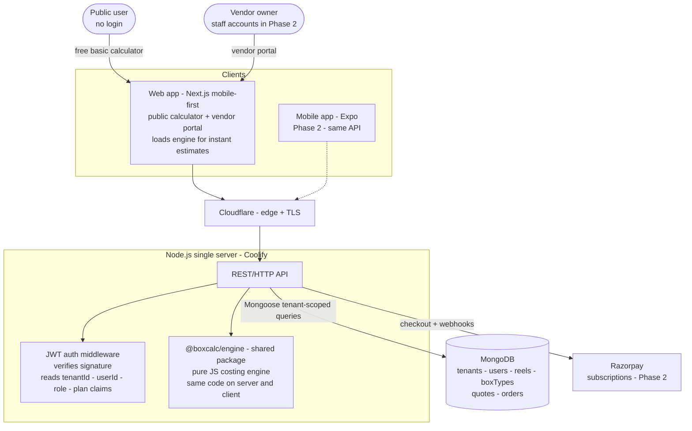
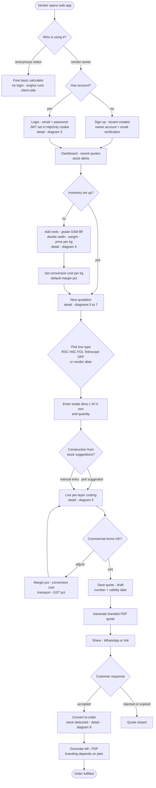
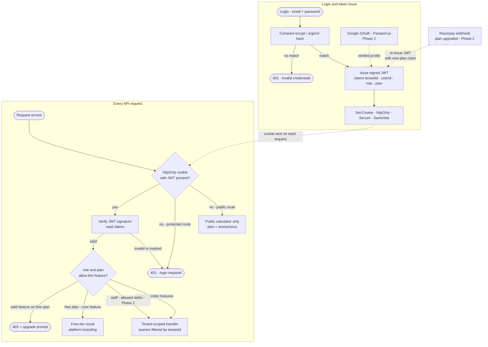
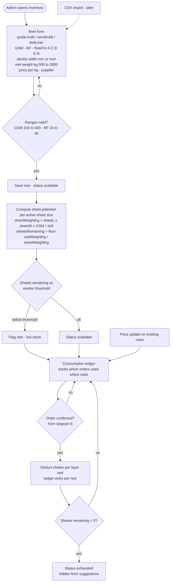
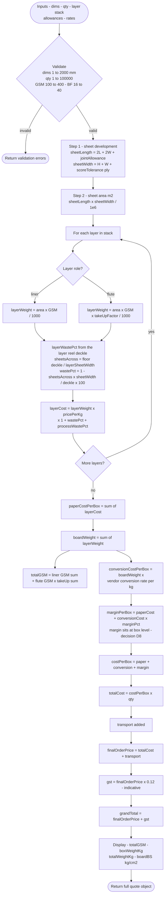
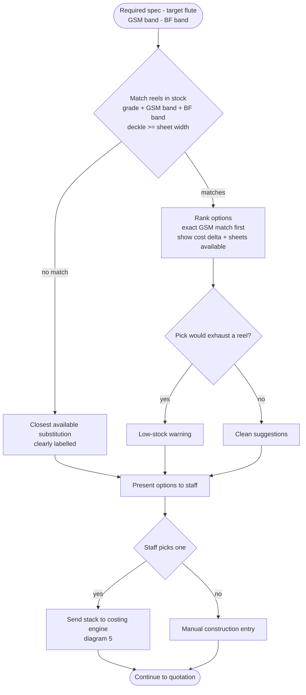
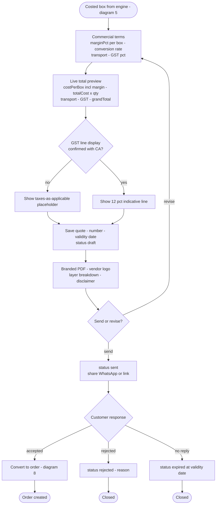
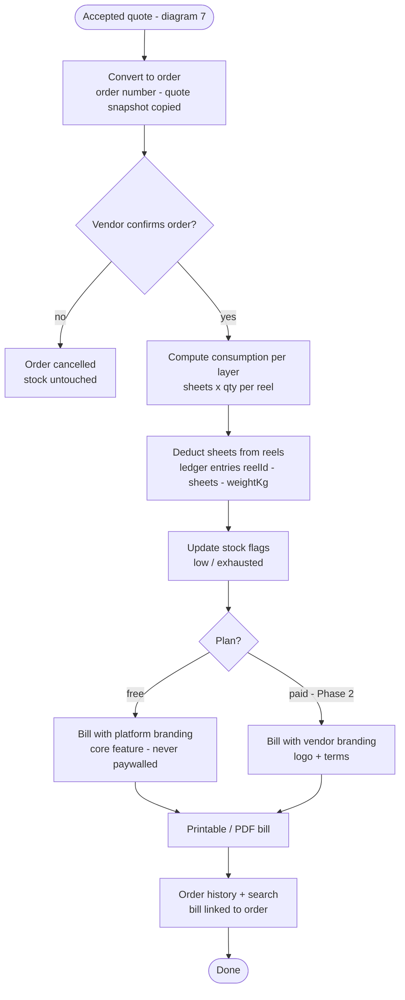
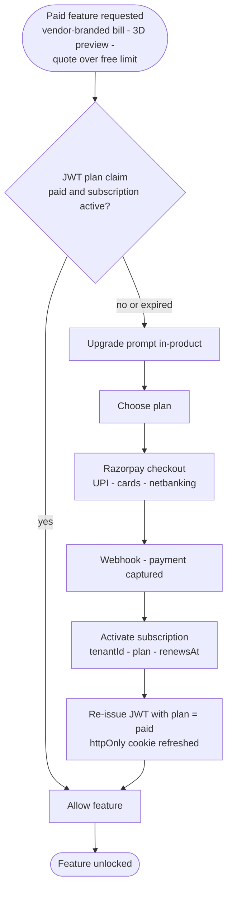
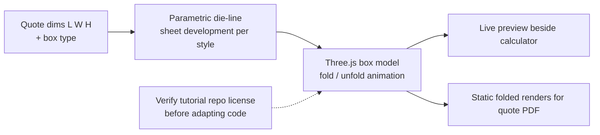

# Flow Chart Document — Box Calculator SaaS for Vendors

| Field | Value |
|---|---|
| Document | Flow charts |
| Version | 2.2 |
| Date | 2026-09-21 |
| Depends on | BRD v2.1, PRD v2.1 |

Ten diagrams arranged as a **zoom-in sequence** for presentation: start with
the whole system, then expand each subsystem in depth.

| # | Diagram | Zooms into | Phase |
|---|---|---|---|
| 1 | System overview | Everything — clients, server, engine, DB, payments | 1 + 2 |
| 2 | Vendor journey, end-to-end | The happy path across all subsystems | 1 |
| 3 | Auth & permissions | JWT issue + verify, role/plan claims | 1 (parts 2) |
| 4 | Inventory ecosystem | Reels, stock status, ledger, deduction | 1 |
| 5 | Costing engine | The 11-step per-layer algorithm | 1 |
| 6 | Stock-aware suggestion | How board specs are matched to reels | 1 |
| 7 | Quotation finalisation | Terms, PDF, sharing, quote lifecycle | 1 |
| 8 | Orders & bills | Order confirmation, stock deduction, billing | 1 |
| 9 | Subscription & paywall | Razorpay checkout, JWT re-issue on upgrade | 2 |
| 10 | 3D preview | Parametric die-line, Three.js fold | 2 |

All labels are quoted — safe to paste into mermaid.live, GitHub, Notion, or
VS Code (Mermaid extension).

---

## 1. System overview

Everything at a glance: who uses the app, what runs where, and what talks
to what. Each later diagram expands one block of this picture.

---

## 2. Vendor journey — end-to-end (Phase 1)

The happy path a vendor walks through; each box points to the diagram that
expands it in depth.

---

## 3. Auth & permissions — JWT lifecycle

How tokens are issued, and how every request is checked. No sessions, no
auth framework — a signed JWT carries the permission claims.

---

## 4. Inventory ecosystem — reels, stock, ledger

Everything that happens to a reel from entry to exhaustion.

---

## 5. Costing engine — per-layer algorithm

The 11-step pipeline (PRD §5). All intermediate values are returned for the
breakdown UI.

---

## 6. Inventory-aware suggestion

The differentiator: only recommend board specs buildable from stock on hand.

---

## 7. Quotation finalisation & sharing

From costed box to sent quote and its lifecycle.

---

## 8. Orders & bills (Phase 1)

Confirmation, automatic stock deduction, and bill generation.

---

## 9. Subscription & paywall (Phase 2)

Razorpay only for now; a payment-provider abstraction keeps Creem open for
later. The webhook re-issues the JWT so the plan claim stays fresh.

---

## 10. 3D preview (Phase 2)

Parametric fold/unfold driven by the quote — adapted from the
`uuuulala/Threejs-folding-cardboard-box-tutorial` demo after a license
check.

---

## Diagram conventions

- Every node label is quoted (`A["text"]`, `A{"text"}`, `A(["text"])`) —
  colons, apostrophes, slashes and comparison signs are safe everywhere.
- Rounded rectangles = process steps; diamonds = decisions;
  `(["..."])` = start/end; dotted arrows = Phase 2 or later.
- Items marked "indicative" or "confirm with CA/vendor" correspond to
  open questions in the BRD/PRD and `docs/CORRECTED-NOTES.md`.
- Paste any block into mermaid.live, GitHub, Notion, or VS Code
  (Mermaid extension) to render.

---

*Diagrams rendered via Mermaid — paste into mermaid.live, GitHub, Notion, or VS Code (Mermaid extension).*
