# Modules & Data-Flow Master Diagram — Box Calculator SaaS

| Field | Value |
|---|---|
| Document | Modules and data-flow master diagram |
| Version | 1.0 |
| Date | 2026-09-22 |
| Depends on | BRD v2.1, PRD v2.1, Flow charts v2.2, Corrected notes v2 |
| Scope | One diagram - every module, what is typed by the user, what the system computes, and which module each borrowed value comes from |

This is the **single zoomed-out master view** the flow-chart zoom-in sequence
(`docs/FLOWCHART.md`) expands diagram by diagram. Module numbers follow the
PRD (§4). `D#` references point to the decision log in
`docs/CORRECTED-NOTES.md`.

## How to read the diagram

- **Green** = typed by a human (admin / staff / public user).
- **Blue** = computed by the system (formula or engine step, not editable).
- **Orange** = value borrowed from another module (its true origin is shown).
- **Purple, dotted** = Phase 2 module or link; **dotted arrows** = Phase 2 data flow.
- Every orange node answers: *"where does this value actually come from?"*

## The diagram

```mermaid
flowchart TB
  classDef input fill:#e8f5e9,stroke:#2e7d32,color:#1b5e20
  classDef computed fill:#e3f2fd,stroke:#1565c0,color:#0d47a1
  classDef external fill:#fff3e0,stroke:#ef6c00,color:#e65100
  classDef phase2 fill:#f3e5f5,stroke:#6a1b9a,color:#4a148c,stroke-dasharray: 5 5

  subgraph LEGEND["Legend"]
    LG1["Typed by admin or staff"]:::input
    LG2["Computed by the system"]:::computed
    LG3["Borrowed from another module"]:::external
    LG4["Phase 2 item"]:::phase2
  end

  ADMIN(["Vendor admin - owner"])
  STAFF(["Vendor staff - roles and invites are Phase 2"]):::phase2
  PUB(["Public user - no login"])

  subgraph M1["Module 1 - Authentication and Authorization"]
    A1["Signup or login - email + password<br/>signup creates the tenant and owner account"]:::input
    A2["role - admin or staff"]:::input
    A3["passwordHash - bcrypt or argon2"]:::computed
    A4["Signed JWT in httpOnly cookie<br/>claims - tenantId - userId - role - plan"]:::computed
    A1 --> A3
    A3 --> A4
    A2 --> A4
  end

  GATE["Auth gate on every API request<br/>tenantId isolates vendor data - role allows admin-only options<br/>plan gates paid features (free plan keeps core features forever)"]:::computed

  subgraph M2["Module 2 - Inventory - reels"]
    I1["Reel entry form - typed by admin (staff later)<br/>grade kraft / semiKraft / testLiner - GSM 100-400 - BF 16-40<br/>fluteFor A C B E N - deckle width mm<br/>reel weight 500-3000 kg - price per kg - supplier"]:::input
    I2["Reel to sheet conversion<br/>sheetWeightKg = sheetL x sheetW x GSM / 1e9<br/>sheetsRemaining = floor(reelWeight / sheetWeight)"]:::computed
    I3["Stock status - available / low / exhausted<br/>exhausted reels are hidden from suggestions"]:::computed
    I4["Consumption ledger<br/>which orders consumed which reels"]:::external
    I1 --> I2
    I2 --> I3
    I4 --> I3
  end

  subgraph M4["Module 4 - Inventory-aware Suggestion"]
    S1["Required spec - target flute - GSM band - BF band"]:::input
    S2["Match stock reels<br/>grade + GSM band + BF band + deckle >= sheet width"]:::computed
    S3["Rank options - exact GSM first<br/>cost delta + sheets available<br/>low-stock warning + closest-available substitution"]:::computed
    S1 --> S2
    S2 --> S3
  end

  subgraph M3["Module 3 - Calculator - box costing engine"]
    C0["Public free calculator - no login<br/>engine runs client-side - manual specs - no inventory"]:::input
    C1["Box type - RSC / HSC / FOL / Telescope / OPF /<br/>Die-Cut / Multi-Depth + vendor alias names"]:::input
    C2["Inside dims L W H mm - quantity 1-100000<br/>ply 3 / 5 / 7 (9 = admin-only triple-wall) - flute A C B E N"]:::input
    C3["Allowances - joint mm + score tolerance by ply<br/>3p 6 - 5p 12 - 7p 18 - 9p 24 (admin-editable)"]:::input
    C4["Layer stack per ply - reelId - GSM - BF - price per kg - deckle<br/>BORROWED from Module 2 - typed there by admin or staff"]:::external
    C5["Take-up factor from verified table - not user input<br/>A 1.55 - C 1.44 - B 1.33 - E 1.27 (supplier-overridable)"]:::computed
    C6["Waste pct computed from the layer reel deckle offcut (D9)<br/>wastePct = (1 - sheetsAcross x sheetWidth / deckle) x 100<br/>optional tenant process-waste add-on"]:::computed
    CV["Validate - dims 1-2000 mm - qty 1-100000 - GSM 100-400 - BF 16-40"]:::computed
    C7["Costing pipeline - PRD section 5<br/>sheetLength = 2L + 2W + joint - sheetWidth = H + W + score<br/>layerWeight = area x GSM / 1000 (flute layers x takeUp)<br/>layerCost = weight x pricePerKg x (1 + waste + processWaste)<br/>outputs - paperCostPerBox - boardWeight - totalGSM - boardBS - boxWeightKg"]:::computed
    C0 --> CV
    C1 --> CV
    C2 --> CV
    C3 --> CV
    C4 --> CV
    C4 --> C6
    C5 --> C7
    C6 --> C7
    CV --> C7
  end

  subgraph M5["Module 5 - Quotation"]
    Q1["Commercial terms<br/>marginPct per box (D8) + conversion rate Rs per kg (D10 - required)<br/>defaults from tenant settings set by admin - staff adjusts per quote<br/>transport + GST 12 pct indicative (CA to confirm)<br/>order discount optional - off by default"]:::input
    Q2["Price pipeline - engine steps 5 to 10<br/>conversionCost = boardWeight x rate<br/>marginPerBox = (paperCost + conversionCost) x marginPct<br/>costPerBox = paper + conversion + margin<br/>totalCost = costPerBox x qty<br/>grandTotal = totalCost - discount + transport + GST"]:::computed
    Q3["Quote record - number - validity date<br/>status draft / sent / accepted / rejected / expired"]:::computed
    Q4["Branded PDF quote + WhatsApp or link share<br/>vendor name - logo - terms + non-binding disclaimer"]:::computed
    Q1 --> Q2
    Q2 --> Q3
    Q3 --> Q4
  end

  subgraph M6["Module 6 - Orders and Bills"]
    O1["Accepted quote - snapshot copied to the order"]:::external
    O2["Vendor confirms order"]:::input
    O3["Consumption per layer - sheets x qty per reel<br/>ledger entries reelId - sheets - weightKg"]:::computed
    O4["Bill PDF - branding by plan claim<br/>free = platform branding - paid = vendor branding"]:::external
    O5["Order history + search - bill linked to order"]:::computed
    O1 --> O2
    O2 --> O3
    O3 --> O4
    O4 --> O5
  end

  subgraph M7["Module 7 - Subscription and Paywall (Phase 2)"]
    P1["Choose plan - Razorpay checkout - UPI / cards / netbanking<br/>Creem kept open behind provider abstraction (D6)"]:::input
    P2["Webhook - payment captured<br/>activate subscription - tenantId - plan - renewsAt"]:::computed
    P3["Re-issue JWT with new plan claim - cookie refreshed"]:::computed
    P1 --> P2
    P2 --> P3
  end

  subgraph M8["Module 8 - 3D Preview (Phase 2)"]
    V1["Quote dims L W H + box type"]:::external
    V2["Parametric die-line per style<br/>Three.js fold and unfold - static renders for quote PDF"]:::computed
    V1 --> V2
  end

  %% ---- users ----
  ADMIN --> A1
  STAFF -.-> A1
  ADMIN --> I1
  STAFF -.->|"if granted"| I1
  PUB --> C0

  %% ---- auth gating ----
  A4 --> GATE
  GATE -.->|"tenantId + role + plan"| I1
  GATE -.->|"stock-first costing"| C1
  GATE -.->|"suggestions need stock"| S1
  GATE -.->|"commercial terms"| Q1
  GATE -.->|"order confirmation"| O2
  GATE -.->|"403 + upgrade prompt"| P1

  %% ---- inventory feeds calculator and suggestions ----
  I1 -->|"reelId - GSM - BF - price per kg - deckle"| C4
  I3 -->|"stock on hand"| S2
  S3 -->|"staff picks a buildable stack"| C4

  %% ---- calculator feeds quotation ----
  C7 -->|"paperCostPerBox + boardWeight + board metrics"| Q2

  %% ---- quotation feeds orders ----
  Q3 -->|"status accepted"| O1

  %% ---- orders feed back into inventory ----
  O3 -->|"stock deducted + ledger entries"| I4

  %% ---- subscription feeds ----
  P3 -.->|"plan = paid - plan claim fresh"| A4

  %% ---- 3d preview ----
  Q3 -.->|"dims + box type"| V1
```

## Module-by-module — input vs computed vs borrowed

### Module 1 — Authentication & Authorization

| Kind | Data | Where it comes from / how |
|---|---|---|
| User input | email, password, role (admin / staff) | Owner signup creates the tenant; staff accounts and invites are Phase 2 (FR-A.1, FR-A.6) |
| Computed | passwordHash (bcrypt / argon2), signed JWT `{tenantId, userId, role, plan}` in httpOnly cookie | FR-A.2–A.4; claims are re-read on every request (flowchart 3) |
| Borrowed | `plan` claim | Re-issued by the Subscription webhook on upgrade / downgrade (Phase 2, FR-P.3) |

### Module 2 — Inventory (reels)

| Kind | Data | Where it comes from / how |
|---|---|---|
| User input | grade, GSM 100–400, BF 16–40, fluteFor (A/C/B/E/N), deckle width, reel weight 500–3000 kg, price ₹/kg, supplier | Typed by the **admin** today; staff may be granted access in Phase 2 (FR-I.1, UC2) |
| Computed | sheetWeightKg = L×W×GSM ÷ 10⁹; sheetsRemaining = floor(reelWeight ÷ sheetWeight); stock status available / low / exhausted | Reel→sheet conversion (FR-I.2, BR4); exhausted reels leave the suggestion pool |
| Borrowed (in) | consumption ledger entries `{reelId, sheets, weightKg}` | Written by **Orders** when an order is confirmed (FR-O.2) |
| Feeds | reelId, GSM, BF, price/kg, deckle → Calculator layer stack; stock status → Suggestion | The costing uses the vendor's **actual reel price**, never market defaults (BR8) |

### Module 4 — Inventory-aware Suggestion

| Kind | Data | Where it comes from / how |
|---|---|---|
| User input | required spec — target flute, GSM band, BF band | Staff, at quote time |
| Computed | matching (grade + GSM band + BF band + deckle ≥ sheet width), ranking, cost delta, low-stock warnings, closest-available substitution | Only specs buildable **from stock on hand** (FR-S.1–S.4, BR7) |
| Feeds | the picked layer stack → Calculator | Staff picks a suggested stack or enters one manually |

### Module 3 — Calculator (box costing engine)

| Kind | Data | Where it comes from / how |
|---|---|---|
| User input | box type (RSC / HSC / FOL / Telescope / OPF / Die-Cut / Multi-Depth + vendor aliases), inside dims L×W×H, quantity 1–100000, ply 3/5/7 (9 = admin-only), flute, joint allowance, score tolerance ladder (3p 6 / 5p 12 / 7p 18 / 9p 24 — admin-editable) | FR-C.1–C.3; 9-ply gating comes from the `role` claim |
| Computed | sheet development (2L+2W+joint × H+W+score), sheet area, per-layer weights (flute × take-up factor from the verified table A 1.55 / C 1.44 / B 1.33 / E 1.27), **waste % from the layer reel's deckle offcut (D9)**, paperCostPerBox, boardWeight, totalGSM, boardBS, boxWeightKg | PRD §5 steps 1–4 and 11; take-up and waste are **never user input** |
| Borrowed | per-layer **reelId, GSM, BF, price ₹/kg, deckle** ← **Module 2**, where the admin/staff typed them into the reel form | This is the core lineage: reel data enters once in Inventory and flows into every costing |
| Note | the public free calculator runs the same engine client-side with manual specs and **no inventory values** | BRD §1, flowchart 2 |

### Module 5 — Quotation

| Kind | Data | Where it comes from / how |
|---|---|---|
| User input | margin % per box (D8), conversion rate ₹/kg (D10 — **vendor-supplied, required, no default**), transport, GST % (12% indicative, CA to confirm), order-level discount (optional, off by default) | Defaults live in tenant settings set by the **admin** (UC3); staff adjusts per quote |
| Computed | conversionCost = boardWeight × rate; marginPerBox; costPerBox = paper + conversion + margin; totalCost = × qty; grandTotal = − discount + transport + GST; quote number, validity date, status lifecycle; branded PDF + share link | Engine steps 5–10 on the shared engine (PRD §5); quote metadata per FR-Q.4 |
| Borrowed | paperCostPerBox, boardWeight, totalGSM, boardBS ← **Module 3**; on acceptance the quote snapshot becomes an **Order** (Module 6) | |

### Module 6 — Orders & Bills

| Kind | Data | Where it comes from / how |
|---|---|---|
| User input | vendor confirmation of the order | FR-O.1 |
| Computed | order number, consumption per layer (sheets × qty per reel), ledger entries, bill PDF, order history + search | FR-O.1–O.3 |
| Borrowed | accepted quote snapshot ← **Module 5**; bill **branding** decided by the `plan` claim (free = platform branding, paid = vendor branding) ← **Modules 1 + 7** | BRD §4.2 — bills are never paywalled, branding is |
| Feeds | stock deduction + ledger → back into **Module 2** | Closes the inventory loop (flowchart 8) |

### Module 7 — Subscription & Paywall (Phase 2)

| Kind | Data | Where it comes from / how |
|---|---|---|
| User input | plan choice, payment via Razorpay (UPI / cards / netbanking); Creem stays open behind the provider abstraction (D6) | FR-P.1 |
| Computed | subscription record `{tenantId, plan, status, renewsAt}`; JWT re-issued with the fresh `plan` claim on webhook | FR-P.3; keeps the paywall gate from going stale (PRD §11) |
| Feeds | `plan` claim → Auth gate → bill branding, monthly quote limits, 3D preview, staff seats | Core features are never paywalled (BRD §4.2) |

### Module 8 — 3D Preview (Phase 2)

| Kind | Data | Where it comes from / how |
|---|---|---|
| Borrowed | dims L×W×H + box type ← the **Quote** (Module 5) | FR-V.2 — parametric die-line per style; Three.js fold; license of the source tutorial repo still to verify (D7) |

## Data lineage at a glance

| Consumer | Value | Produced in | Typed by |
|---|---|---|---|
| Calculator layer stack | reelId, GSM, BF, price/kg, deckle | Inventory reel form | Admin (staff later) |
| Suggestion | stock status, sheets remaining | Inventory (computed from reel weight + sheet size) | — |
| Quotation | paperCostPerBox, boardWeight, board metrics | Calculator engine | Dims/qty by staff; layer stack from Inventory |
| Quotation terms | conversion rate, margin defaults | Tenant settings | Admin (UC3) |
| Orders | accepted quote snapshot | Quotation | — |
| Inventory | ledger entries + stock deduction | Order confirmation | — |
| Auth JWT | `plan` claim | Subscription webhook re-issue (Phase 2) | — |
| Bill PDF | branding (platform vs vendor) | `plan` claim via Auth gate | — |
| 3D preview | dims + box type | Quote record | — |

---

*Paste the mermaid block into mermaid.live, GitHub, Notion, or VS Code (Mermaid extension) to render.*
