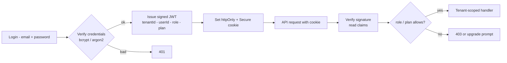
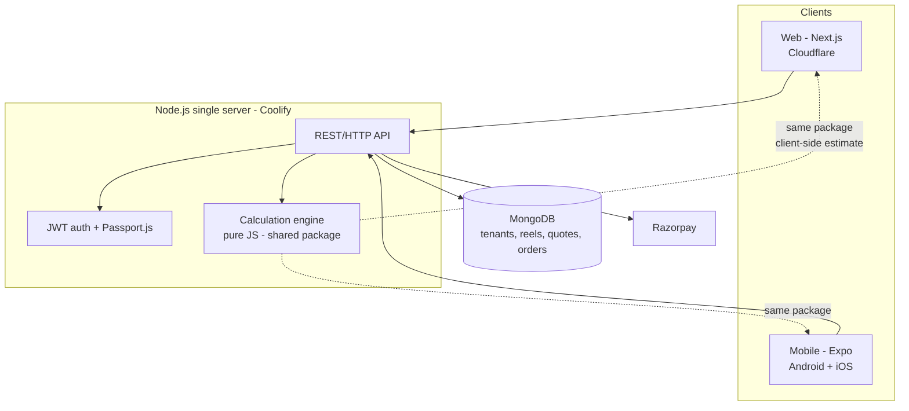

# Product Requirements Document (PRD) — Box Calculator SaaS for Vendors

| Field | Value |
|---|---|
| Document | PRD |
| Version | 2.1 |
| Date | 2026-09-21 |
| Status | Draft for review |
| Depends on | BRD v2.1 (`docs/BRD.md`), Corrected research (`docs/CORRECTED-NOTES.md`) |
| Related | Flow charts v2.1 (`docs/FLOWCHART.md`) |

---

## 1. Purpose

Translate the business objectives in the BRD into buildable product
requirements for the Box Calculator SaaS — a vendor platform for
inventory-aware box costing, quotation and visualisation. Phase 1 delivers
the web app (Next.js); Phase 2 delivers mobile (Expo) reusing the same
engine and API.

## 2. Users & Personas

| Persona | Context | Primary job |
|---|---|---|
| **Vendor admin (Suresh)** | Owns a 20-staff box plant | Set conversion rates, margins, approve staff; keep reel inventory current |
| **Vendor staff (Priya)** | Produces 20–40 quotes/day | Enter box requirements, pick stock-aware board, send quotation fast |
| **Platform admin (internal)** | Operates the SaaS | Manage tenants, subscriptions, feature flags, support |

## 3. Product Principles

1. **Stock-first** — every recommendation and cost is anchored to the
   vendor's actual reel inventory (GSM, BF, width, price).
2. **Layer-level transparency** — each ply layer (outer liner, flute,
   inner liner) is costed separately; no single blended GSM.
3. **Standard catalogue, vendor aliases** — box types use the
   industry-standard styles vendors deal in (RSC, HSC, FOL, Telescope,
   OPF); each tenant can attach custom trade names (e.g., "Masala 5-ply
   Exporter") as aliases.
4. **One engine, many skins** — the calculation engine is pure logic shared
   by web, mobile and server-side recalculation.
5. **Indicative, not binding** — quotations carry a visible disclaimer;
   the vendor confirms the final price.

## 4. Modules & Functional Requirements

Priority: **M** = must (Phase 1), **S** = should (Phase 1 if time),
**C** = could (Phase 2+).

### Module 1 — Authentication & Authorisation (JWT + Passport.js)
Stateless JWT auth — no auth framework, no server-side sessions. A signed
token carries `{tenantId, userId, role, plan}` claims so permission checks
(owner vs staff, paid vs free vs anonymous public) read straight from the
token. Token lifetime scheme (single access token vs access + refresh) is
an open question (§12).

- FR-A.1 (M) Vendor signup — one owner account per vendor; tenant (org)
  created on signup; email verification.
- FR-A.2 (M) Issue signed JWT at login; verify signature + claims on every
  API request; tenant isolation enforced from the `tenantId` claim.
- FR-A.3 (M) Token transport: httpOnly + Secure cookie on web. Storage for
  the future Expo app (secure storage) decided when mobile work starts.
- FR-A.4 (M) Password hashing with bcrypt/argon2 (plain JS libraries).
- FR-A.5 (S) Password reset, account deletion (store-policy requirement
  for mobile).
- FR-A.6 (C) Full auth & roles (Phase 2, BRD §4.2): staff accounts,
  owner/staff roles, staff invites, seat limits; platform `superadmin`.
- FR-A.7 (C) Google login via Passport.js OAuth (Phase 2).



### Module 2 — Inventory (reels)
- FR-I.1 (M) Reel register with fields: GSM, BF, grade (Kraft / Semi-Kraft /
  TestLiner), flute compatibility, deckle/sheet width (mm or inch), reel
  weight (kg; typical 500–3000), price ₹/kg, supplier, entry date.
- FR-I.2 (M) Reel → sheet conversion: sheets remaining =
  `floor(reelWeightKg ÷ sheetWeightKg)`; deduct per quote/order.
- FR-I.3 (M) Stock status: available / low / exhausted, per reel.
- FR-I.4 (M) Manual data entry forms (per research decision); **CSV/sheet
  upload later** (C).
- FR-I.5 (S) Consumption ledger: which quotes/orders consumed which reels.
- FR-I.6 (C) CSV import/export; barcode/QR for physical reels.

### Module 3 — Calculator (box costing engine)
- FR-C.1 (M) Box configuration: inside dims L×W×H (mm), quantity, ply
  (3/5/7 standard; 9 = triple-wall special, admin-only), flute per
  corrugating medium (A/C/B/E/N from stock).
- FR-C.1a (M) Box catalogue — industry-standard styles (see §5a):
  **RSC** (FEFCO 0201, default), **HSC** & **FOL** (slotted family),
  **Telescope** (0300-series) and **OPF / FPF folder-type** (0400-series)
  — all Phase 1 per BRD §4.1; die-line formulas for Telescope/OPF to be
  confirmed from vendor templates. **Die-Cut** and **Multi-Depth** are also
  in the Phase 1 catalogue (style-specific die templates). RSC is never
  removed — it is the industry standard many vendors already use. Vendors
  attach custom names (aliases) per tenant.
- FR-C.2 (M) Per-layer construction: each liner and flute layer has its own
  GSM/BF/price — **no blended GSM** (research: "each layer will have
  different GSM").
- FR-C.3 (M) Allowances: joint allowance (mm), score tolerance per ply
  (3→6, 5→12, 7→18, 9→24 mm — confirm 5-ply), flute take-up factor per
  flute type. **Waste % is computed by the engine from reel data** (deckle
  offcut, see §5 step 3 — decision D9), with an optional small
  process-waste add-on per tenant.
- FR-C.4 (M) Full costing pipeline (see §5) producing sheet size, sheet
  area, per-layer weights & costs, box weight, total weight, board BS,
  total GSM, conversion cost, margin per box, per-box cost.
- FR-C.5 (M) Display metrics: weight of 1 box, weight of total quantity,
  overall BS (kg/cm²) of the board.
- FR-C.6 (M) Validation: finite positive dims, qty 1–100,000, dimension cap
  (e.g., 2000 mm/side), GSM 100–400, BF 16–40 ranges.
- FR-C.7 (S) Cutting method awareness: slotted (always corrugated) vs
  die-cut (corrugated or folding carton) — drives allowed material types.
- FR-C.8 (C) Folding carton / duplex board path (GSM 90–400, die-cut) as a
  second material family alongside corrugated.

### Module 4 — Inventory-aware Suggestion (differentiator)
- FR-S.1 (M) Given required board GSM/BF and flute, suggest only
  constructions buildable from **stock on hand** (reels matching grade,
  GSM band, BF band, usable deckle width).
- FR-S.2 (M) Rank suggestions: exact GSM match > closest; show per-option
  cost delta and stock depth (sheets available).
- FR-S.3 (M) Low-stock warning when a suggestion would exhaust a reel.
- FR-S.4 (S) "Closest available" fallback when the exact spec is missing,
  clearly labelled as a substitution.

### Module 5 — Quotation
- FR-Q.1 (M) Quote builder: config from calculator + margin % (applied
  **per box**), **vendor-supplied conversion cost** (₹/kg — required, no
  system default; decision D10 — covers machines, labour, corrugating,
  slotting, printing, stitching), transport cost, GST 12% (indicative,
  CA-confirmed).
- FR-Q.2 (M) Pipeline: per-box cost (paper + conversion + margin) →
  total cost (× qty) → transport → GST → **final order price**.
  (Order-level discount optional, off by default.)
- FR-Q.3 (M) Printable/PDF quote with vendor branding (name, logo, terms).
- FR-Q.4 (M) Quote numbering, status (draft/sent/accepted/rejected/expired),
  validity date.
- FR-Q.5 (S) Share via WhatsApp/deep link; duplicate/revise quote.
- FR-Q.6 (M) Quote → order conversion (Module 6).

### Module 6 — Orders & Bills
- FR-O.1 (M) Convert accepted quotes to orders; order history & search.
- FR-O.2 (M) On confirmation, deduct sheets from reels (ledger entries).
- FR-O.3 (M) Printable/PDF bill for confirmed orders — free-plan bills
  carry the platform's branding; vendor-branded bills are a paid feature
  (BRD §4.2).

### Module 7 — Subscription & Paywall (Phase 2)
- FR-P.1 (C) Plans via Razorpay (UPI / cards / netbanking); a thin
  payment-provider abstraction keeps Creem open as a later addition.
- FR-P.2 (C) Free plan keeps calculator, inventory, suggestions, quotes
  and order history forever — core features are never paywalled (BRD
  §4.2); N quotes/month and platform-branded bills on free. Paid:
  unlimited quotes, vendor-branded bills, 3D preview, extra staff seats.
- FR-P.3 (C) Feature gating middleware reads the plan claim from the JWT;
  upgrade prompts in-product; token re-issued on Razorpay webhook.

### Module 8 — 3D Preview (Phase 2)
- FR-V.1 (C) Base implementation adapted from
  `uuuulala/Threejs-folding-cardboard-box-tutorial` (Three.js + GSAP folding
  cardboard box — the Codrops tutorial). It is a hard-coded demo, not a
  library: reimplement parametrically and **verify the repo's license**
  before shipping adapted code.
- FR-V.2 (C) Make the fold/unfold die-line parametric: driven by quote
  dimensions (L×W×H), sheet development and box type; live preview beside
  the calculator.
- FR-V.3 (C) Static folded renders for quotes/PDF; optional
  React-Three-Fiber wrapper for React integration.

## 5. Costing Algorithm (corrected — per-layer)

Inputs: box L, W, H (mm, inside), quantity, ply construction
[{role: liner|flute, GSM, BF, flute type?, price ₹/kg, reelId}], joint
allowance, score tolerance, flute take-up factor, **vendor-supplied
conversion rate ₹/kg**, margin % (per box), transport, GST %.
Waste % per layer is computed from the layer's reel (deckle offcut).

```
1. Sheet development (per box)
   sheetLength = 2L + 2W + jointAllowance            (slotted/RSC family)
   sheetWidth  = H + W + scoreTolerance(ply)         (trim folded in)
   (die-cut styles use style-specific die-line formulas)

2. Sheet area
   areaM2 = (sheetLength × sheetWidth) ÷ 1,000,000

3. Per-layer weights (kg per box) + computed waste
   linerWeight  = areaM2 × linerGSM ÷ 1000
   fluteWeight  = areaM2 × fluteGSM × takeUpFactor ÷ 1000
   layerWaste%  = (1 − sheetsAcross × layerSheetWidth ÷ reelDeckle) × 100
                  where sheetsAcross = floor(reelDeckle ÷ layerSheetWidth)
                  (offcut computed from the layer's own reel)
   layerCost    = layerWeight × pricePerKg × (1 + layerWaste% + processWaste%)
                  (processWaste% = optional tenant add-on, default 0)

4. Paper cost per box
   paperCost = Σ layerCost

5. Conversion cost per box (vendor-supplied rate — required input)
   boardWeight = Σ layerWeight                  (take-up already inside)
   conversionCostPerBox = boardWeight × conversionRate

6. Margin per box (decision D8 — margin sits at box level)
   marginPerBox = (paperCost + conversionCostPerBox) × margin%

7. Cost per box
   costPerBox = paperCost + conversionCostPerBox + marginPerBox

8. Total cost for the order
   totalCost = costPerBox × quantity

9. Transport
   finalOrderPrice = totalCost + transport

10. Tax — GST (indicative)
   gst = finalOrderPrice × 0.12
   grandTotal = finalOrderPrice + gst

11. Display metrics
   totalGSM = Σ liner GSMs + Σ (flute GSM × takeUp)   (board GSM)
   boxWeightKg = boardWeight                          (per box)
   totalWeightKg = boardWeight × quantity
   boardBS = Σ (layerBF × layerGSM) ÷ 1000            (kg/cm², indicative)
```

All intermediate values are returned by the engine for the breakdown UI.

## 5a. Box Catalogue (industry-standard, vendor-aliased)

| Standard ID | Name | Cut family | Blank pieces | Sheet development (indicative) | Phase |
|---|---|---|---|---|---|
| `rsc` | Regular Slotted Container (FEFCO 0201) | Slotted | 1 | `2L+2W+joint` × `H+W+score` | 1 |
| `hsc` | Half-Slotted Container | Slotted | 1 | `2L+2W+joint` × `H+W(bottom flaps)+score` | 1 |
| `fol` | Full-Overlap Slotted Container | Slotted | 1 | `2L+2W+joint` × `H+2W+score` (full-overlap flaps) | 1 |
| `telescope` | Telescope Box (0300-series, full/partial) | Telescope | 2 (lid + body) | two blanks; lid slightly larger — die template to confirm | 1 |
| `opf` | Folder-Type Box / One-Piece Folder (0400-series) | Folder | 1 | wrap-around blank — die template to confirm | 1 |

- Each style is a **data change** (sheetFormula + allowances); the costing
  pipeline is shared. RSC stays the default and is never removed.
- Slotted styles are always corrugated; Telescope/OPF may also be die-cut
  (folding-carton variant, later material family).
- Vendor aliases: tenants rename/label styles for their trade; UI shows
  alias + standard name.

## 6. Non-functional Requirements

| NFR | Requirement |
|---|---|
| NFR-1 Performance | Quote recompute < 50 ms client-side; API p95 < 300 ms |
| NFR-2 Availability | 99.5% (single server + Coolify; nightly Mongo backups) |
| NFR-3 Security | Tenant isolation enforced at data layer; bcrypt/argon2 password hashing; signed JWT in httpOnly cookie (web); rate limiting (in-memory for now) |
| NFR-4 Responsiveness | Mobile-first: single column ≤ 640 px; two-column ≥ 1024 px |
| NFR-5 i18n/currency | INR, `en-IN` grouping; English UI (Hindi later) |
| NFR-6 Observability | Structured console logging on API + web for now; shared error-logging stack deferred to a later release |
| NFR-7 Privacy | PII limited to vendor accounts; quote recipients' data minimal; account deletion |
| NFR-8 Maintainability | No magic numbers in UI — all rates/allowances configurable per tenant |

## 7. Architecture



- **Backend:** Node.js (JS), Express/Fastify, Mongoose; JWT auth
  (httpOnly cookie on web) with bcrypt/argon2, Passport.js for Google
  login (Phase 2); Razorpay for billing. Redis queues and a shared
  error-logging stack are deferred until scale demands them.
- **Web:** Next.js (mobile-first responsive), deployed via Coolify behind
  Cloudflare.
- **Mobile:** Expo (React Native) wrapping shared logic; chosen over
  Capacitor + separate framework and over Kotlin (learning curve per
  research).
- **Shared package:** `@boxcalc/engine` — pure functions, no framework
  imports; consumed by web, mobile and API.

## 8. Data Model (MongoDB, tenant-scoped)

**Tenant / User**
```
Tenant { name, slug, settings{ conversionRate, defaultWastePct, defaultMarginPct, gstPct } }
User   { tenantId, email, passwordHash, role: admin|staff, name }
```

**Reel (inventory)**
```
Reel { tenantId, grade: kraft|semiKraft|testLiner, gsm 100-400, bf 16-40,
       fluteFor: A|C|B|E|N, widthMm (deckle), weightKg 500-3000,
       pricePerKg, supplier, status: available|low|exhausted, entryDate }
```

**BoxType (vendor-defined names)**
```
BoxType { tenantId, standardId: rsc|hsc|fol|telescope|opf,
          vendorAlias "Masala Exporter", construction: 3|5|7|9,
          cutMethod: slotted|dieCut, flute: A|C|B|E|N,
          sheetFormula: rscFamily|hsc|fol|dieLineId,
          allowances{ jointMm, scoreMm }, active }
```

**Quote**
```
Quote { tenantId, number, status, createdBy, boxTypeId,
        dims{ L, W, H }, quantity,
        layers[ {role, reelId, gsm, bf, takeUp, pricePerKg, computedWastePct} ],
        sheet{ lengthMm, widthMm }, areaM2, totalGsm, perLayerCosts[], paperCostPerBox,
        conversionRate (vendor-supplied), conversionCostPerBox, marginPct, marginPerBox,
        costPerBox (incl. margin), totalCost (= costPerBox × qty),
        transport, gstPct, gstAmt, finalOrderPrice,
        boxWeightKg, totalWeightKg, boardBS, validityDate, shareToken }
```

**Order**
```
Order { tenantId, quoteId, status, confirmedAt,
        consumptions[ { reelId, sheets, weightKg } ] }
```

**Subscription (Phase 2)**
```
Subscription { tenantId, provider: razorpay, plan, status, renewsAt }
```

## 9. UX Flow (screen-level)

1. Login → vendor dashboard (recent quotes, stock alerts).
2. New quote: box type (RSC / HSC / FOL + vendor aliases) → dims → construction (suggested from
   stock) → quantity → commercial terms.
3. Live estimate panel with layer-wise breakdown; 3D preview (Phase 2).
4. Save → generate PDF → share on WhatsApp.
5. Admin: inventory CRUD, vendor conversion cost & margin settings. Staff
   invites, subscription/paywall and 3D preview arrive in Phase 2.

## 10. Release Plan

| Release | Contents |
|---|---|
| R0 (foundations) | Data model freeze, engine package + unit tests, JWT auth scaffold (owner login) |
| R1 (MVP web) | Inventory, calculator + suggestions, RSC + HSC + FOL + Telescope + folder styles, quotation + PDF, orders + stock deduction + bills |
| R2 (mobile + billing) | Expo app, Razorpay subscriptions/paywall, full auth (staff roles, invites, Google via Passport.js), 3D preview (uuuulala repo adaptation) |
| R3 | CSV import, dashboards, Hindi UI; Redis queues + shared error logging when scale demands |

## 11. Risks & Mitigations

| Risk | Impact | Mitigation |
|---|---|---|
| Wrong take-up/waste assumptions | Wrong prices → vendor losses | Take-up from verified table; waste computed from reel deckle — validate offcut formula with 2–3 pilot vendors' actuals |
| Inventory never updated | Suggestions mislead staff | Low-friction entry, CSV import, weekly digest prompts |
| Tenant data leak | Fatal for SaaS trust | Tenant-scoped queries + integration tests + audits |
| 3D tutorial repo is a hard-coded demo, not a library | Adaptation effort in Phase 2 | Parametric reimplementation scoped; verify repo license before reuse |
| JWT plan claim goes stale after upgrade/downgrade | Wrong paywall gating | Re-issue token on Razorpay webhook; decide token lifetime scheme before R1 auth build |
| Billing provider change (Creem later) | Paywall rework | Razorpay first, behind a payment-provider abstraction |

## 12. Open Questions

1. Score tolerance for 5-ply — 12 mm (per research pattern) or interpolated? Confirm with vendor.
2. GST 12% — confirm with CA; show as separate line or inclusive?
3. Razorpay confirmed for billing; when (and whether) to add Creem as a
   second provider — keep the payment-provider abstraction ready.
4. Paywall split — which features free vs paid (quotes/mo count? staff seats?).
5. Conversion cost is vendor-supplied — capture at tenant level, per box
   type, or per quote?
6. Transport — flat per order, per box, or distance-based?
7. Deckle width matching — should the engine reject reels narrower than the sheet width, or allow rotation/two-up?
8. Margin per box — applied on (paper + conversion) cost as documented; confirm whether finishing/printing extras (Phase 3) join the margin base.
9. 3D repo license — confirm `uuuulala/Threejs-folding-cardboard-box-tutorial` licensing before shipping adapted code.
10. Computed waste — does deckle-offcut capture real-world losses (setup, pasting rejects), or is a process-waste add-on needed? Validate with pilots.
11. JWT lifetime scheme — single long-lived access token vs short access
    + refresh; decide before R1 auth build.
12. Mobile token storage — httpOnly cookie on web; confirm Expo
    secure-storage approach when mobile work starts.

---

*Diagrams rendered via Mermaid — paste into mermaid.live, GitHub, Notion, or VS Code (Mermaid extension).*
