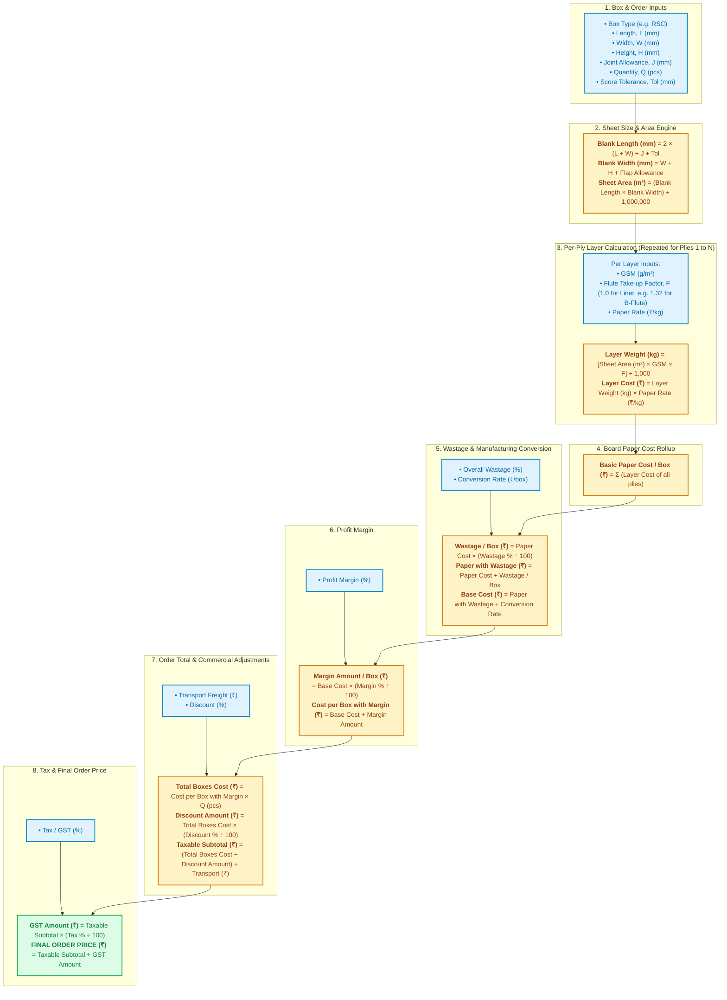

# Box Calculator — Calculation Flow

A straightforward, step-by-step reference showing how values move through the calculator, the exact formulas used, and the units at every stage.

---

## 1. Visual Flowchart

---

## 2. Box Type Specific Sheet Formulas (Blank Length & Width)

The required sheet width (Deckle) and sheet length (Chop) are **specifically tailored for each box style** based on its flap design:

| Box Style | FEFCO Code | Blank Length ($mm$) | Blank Width / Reel Width Needed ($mm$) | Description |
| :--- | :--- | :--- | :--- | :--- |
| **RSC** (Regular Slotted) | 0201 | $2 \times (L + W) + 4 \times \text{Tol} + J$ | $W + H + 2 \times \text{Tol}$ | Standard top & bottom flaps meet in center ($\frac{W}{2} + H + \frac{W}{2}$). |
| **HSC** (Half Slotted) | 0200 | $2 \times (L + W) + 4 \times \text{Tol} + J$ | $\frac{W}{2} + H + \text{Tol}$ | Open-top container; has bottom flaps only. |
| **FOL** (Full Overlap) | 0204 | $2 \times (L + W) + 4 \times \text{Tol} + J$ | $2 \times W + H + 2 \times \text{Tol}$ | Heavy-duty top & bottom flaps overlap fully by full width ($W$). |
| **TEL** (Telescope) | 0320 | $2 \times (L + 2H + 2 \times \text{Tol})$ | $W + 2 \times H + 2 \times \text{Tol}$ | Two-piece box (tray + lid). |
| **FLD** (Folder) | 0427 | $2 \times L + 2 \times H + 2 \times \text{Tol} + J$ | $W + 2 \times H + 2 \times \text{Tol}$ | One-piece roll-end mailer folder. |

*Where:*
* $L, W, H$: Inside Length, Width, and Height ($mm$)
* $J$: Joint / glue flap allowance ($mm$, default $35\text{ mm}$)
* $\text{Tol}$: Score tolerance ($mm$, e.g. $6\text{ mm}$ for 3-ply, $12\text{ mm}$ for 5-ply)

---

## 3. Step-by-Step Formula & Unit Reference

| Step | Output | Exact Formula | Units |
| :--- | :--- | :--- | :--- |
| **1. Sheet Dimensions** | Blank Length | Per Box Type formula above | $mm$ |
| | Blank Width | Per Box Type formula above (sets minimum reel width needed) | $mm$ |
| | Sheet Area | $(\text{Blank Length} \times \text{Blank Width}) \div 1,000,000$ | $m^2$ |
| **2. Per-Ply Layer** | Layer Weight | $(\text{Sheet Area} \times \text{GSM} \times \text{Take-up Factor}) \div 1,000$ | $kg\text{ / box}$ |
| | Layer Paper Cost | $\text{Layer Weight} \times \text{Paper Price per kg}$ | $₹\text{ / box}$ |
| **3. Box Paper Total** | Paper Cost / Box | $\sum (\text{Layer Paper Cost of each ply})$ | $₹\text{ / box}$ |
| **4. Overall Wastage** | Wastage / Box | $\text{Paper Cost / Box} \times (\text{Overall Wastage \%} \div 100)$ | $₹\text{ / box}$ |
| | Paper with Wastage | $\text{Paper Cost / Box} + \text{Wastage / Box}$ | $₹\text{ / box}$ |
| **5. Base Manufacturing**| Base Cost / Box | $\text{Paper with Wastage} + \text{Conversion Rate (₹/box)}$ | $₹\text{ / box}$ |
| **6. Profit Margin** | Cost with Margin | $\text{Base Cost / Box} \times (1 + \text{Margin \%} \div 100)$ | $₹\text{ / box}$ |
| **7. Order Total** | Total Pcs Cost | $\text{Cost with Margin} \times \text{Quantity (Q)}$ | $₹$ |
| | Discount Amount | $\text{Total Pcs Cost} \times (\text{Discount \%} \div 100)$ | $₹$ |
| | Taxable Subtotal | $(\text{Total Pcs Cost} - \text{Discount Amount}) + \text{Transport (₹)}$ | $₹$ |
| **8. Final Price** | Tax (GST) | $\text{Taxable Subtotal} \times (\text{Tax \%} \div 100)$ | $₹$ |
| | **Final Order Price**| $\mathbf{\text{Taxable Subtotal} + \text{Tax Amount}}$ | $\mathbf{₹}$ |

---

## 4. Key Takeaways
1. **No Per-Layer Wastage**: Each ply layer is computed at 100% pure theoretical weight ($\text{Area} \times \text{GSM} \times \text{Take-up} \div 1000$).
2. **Single Wastage Factor**: Overall Wastage % is applied once to the aggregated paper cost of all plies.
3. **Additive Commercial Layer**: Conversion, Margin, Transport, Discount, and GST are cleanly layered on top of the physical board cost.
