# Calculation Algorithm Flow Chart — Corrugated Box Costing

| Field | Value |
|---|---|
| Document | Calculation algorithm flow chart |
| Version | 1.1 |
| Date | 2026-09-24 |
| Depends on | PRD v2.1 §5, Corrected notes (D8, D9, D10), Modules data-flow v1.0 |
| Scope | One end-to-end flow of the box costing algorithm — user inputs, per-layer data, sheet development, per-layer costing loop, box rollup, order totals |

This is the dictated costing flow, corrected and generalised so it works for
**all corrugated boxes**: any box style (RSC / HSC / FOL / Telescope / OPF),
any ply count (3 / 5 / 7 / 9 — single, double, triple wall) and any flute mix
(A / C / B / E / N, including mixed flutes in multi-wall boards).

## How to read the diagram

- **Green** = typed by a human (user input).
- **Blue** = computed by the engine (formula, never editable).
- **Orange** = borrowed from the inventory module (reel data).
- **Pink** = final result / display output.

## The flow chart

```mermaid
flowchart TD
  classDef input fill:#e8f5e9,stroke:#2e7d32,color:#1b5e20
  classDef computed fill:#e3f2fd,stroke:#1565c0,color:#0d47a1
  classDef borrowed fill:#fff3e0,stroke:#ef6c00,color:#e65100
  classDef result fill:#fce4ec,stroke:#c2185b,color:#880e4f

  START(["Corrugated box costing starts"]) --> BT

  subgraph PH1["Phase 1 - what the user gives"]
    BT["Box type - RSC / HSC / FOL /<br/>Telescope / OPF / vendor alias"]:::input
    BT --> DIM["Inside dims L W H in mm"]:::input
    DIM --> QTY["Quantity in boxes 1 to 100000"]:::input
    QTY --> JOINT["Joint allowance in mm"]:::input
    JOINT --> PLY["Number of ply - 3 / 5 / 7 / 9<br/>single / double / triple wall"]:::input
  end

  PLY --> STACK["Build the layer stack - alternating liner and flute layers<br/>3p L-F-L - 5p L-F-L-F-L - 7p and 9p extend the pattern<br/>each flute layer keeps its own flute type A C B E N<br/>so mixed-flute multi-wall boards work too"]:::computed

  STACK --> SRC{"Per-layer data source?"}
  SRC -->|"inventory module"| REEL["Per layer from its reel - GSM - BF<br/>price per kg - deckle mm - flute type"]:::borrowed
  SRC -->|"manual entry"| MAN["Per layer typed - GSM - BF - price per kg<br/>flute type A C B E N on flute layers<br/>wastage pct - vendor extra pct"]:::input

  V{"Validate - dims 1 to 2000 mm - qty 1 to 100000<br/>GSM 100 to 400 - BF 16 to 40"}:::computed
  REEL --> V
  MAN --> V
  V -->|"invalid"| ERR(["Show validation errors - fix and restart"])
  ERR --> BT

  V -->|"valid"| SCORE["Score tolerance in mm - by ply ladder - not a per-layer value<br/>3p 6 - 5p 12 - 7p 18 - 9p 24<br/>admin-editable per BoxType"]:::computed

  SCORE --> TUF["Flute take-up factor per flute type<br/>A 1.55 - C 1.44 - B 1.33 - E 1.27<br/>supplier-overridable"]:::computed

  TUF --> TGSM["Total GSM of the board<br/>totalGSM = sum of liner GSM + sum of flute GSM x takeUpFactor"]:::computed

  TGSM --> S1["Sheet development for the chosen box type<br/>RSC slotted default - sheetLength = 2L + 2W + jointAllowance<br/>sheetWidth = H + W + scoreTolerance"]:::computed
  S1 --> S1B["Other styles use their own die formula<br/>HSC bottom flaps only - FOL flaps H + 2W -<br/>Telescope 2 blanks lid + body - OPF wrap-around"]:::computed
  S1B --> S2["Sheet area in m2 - summed over all blanks of the style<br/>1 blank for RSC HSC FOL OPF - 2 for Telescope lid + body<br/>areaM2 = sum of blankLength x blankWidth / 1e6"]:::computed

  S2 --> LOOP["For each layer in the stack"]:::computed
  LOOP --> WSRC{"Wastage pct for this layer?"}
  WSRC -->|"inventory - deckle known"| WC["requires deckle >= layerSheetWidth - a narrower reel is rejected<br/>sheetsAcross = floor(deckle / layerSheetWidth)<br/>wastagePct = (1 - sheetsAcross x layerSheetWidth / deckle) x 100<br/>+ optional vendor process-waste pct"]:::computed
  WSRC -->|"manual entry"| WM["wastagePct and vendorExtraPct as typed"]:::input

  WC --> ROLE{"Layer role?"}
  WM --> ROLE
  ROLE -->|"liner"| LW["Used paper weight of the layer<br/>layerWeightKg = areaM2 x GSM / 1000"]:::computed
  ROLE -->|"flute"| FW["layerWeightKg = areaM2 x GSM x takeUpFactor / 1000"]:::computed

  LC["layerCost = layerWeightKg x pricePerKg<br/>x (1 + wastagePct / 100 + vendorExtraPct / 100)<br/>pcts divided by 100 e.g. 18 pct = 0.18"]:::computed
  LW --> LC
  FW --> LC

  LC --> MORE{"More layers?"}
  MORE -->|"yes"| LOOP

  TERMS["Vendor terms - captured per quote - dynamic<br/>conversion rate Rs per kg - margin pct -<br/>tax pct - transport Rs"]:::input
  MORE -->|"no"| TERMS
  MORE -->|"no - all layer BF and GSM known"| BS

  subgraph AGG["Box level rollup"]
    PAPER["paperCostPerBox = sum of all layerCost<br/>all ply layers incl wastage and vendor extra"]:::computed
    BW["boxWeightKg = sum of all layerWeightKg<br/>weight of 1 box - wastage NOT included"]:::computed
    PAPER --> CPB
    BW --> TW["totalWeightKg = boxWeightKg x quantity<br/>weight of the total quantity"]:::computed
    BW --> CC["conversionCostPerBox = boxWeightKg x conversionRate<br/>vendor-supplied - required - no default D10"]:::computed
    CC --> MARG["marginPerBox = (paperCostPerBox + conversionCostPerBox)<br/>x marginPct - margin sits at box level - D8"]:::computed
    MARG --> CPB["costPerBox = paperCostPerBox + conversionCostPerBox + marginPerBox"]:::computed
    CPB --> TC["totalCost = costPerBox x quantity"]:::computed
  end

  TERMS --> CC
  TERMS --> MARG

  TC --> FOP["finalOrderPrice = totalCost + transport"]:::computed
  TERMS --> FOP
  FOP --> TAX["tax = finalOrderPrice x taxPct<br/>GST indicative 12 pct - confirm with CA"]:::computed
  TERMS --> TAX
  TAX --> GT["grandTotal = finalOrderPrice + tax"]:::result

  BS["boardBS in kg per cm2 = sum of layerBF x layerGSM / 1000<br/>overall BS of the board - for display - indicative"]:::result
  BS --> SHOW["Display breakdown - totalGSM - boxWeightKg - totalWeightKg -<br/>boardBS - costPerBox - grandTotal"]:::result
  GT --> SHOW
  SHOW --> OUT(["Quote ready - full breakdown returned"])
```

## Who provides what

| Value | Source |
|---|---|
| Box type, inside dims L W H, quantity, joint allowance, number of ply | **User input** |
| Per layer: GSM, BF, flute type, take-up factor, price per kg, deckle | **Inventory module** (the layer's reel) **or manual user entry** |
| Score tolerance | By ply ladder (3p 6 / 5p 12 / 7p 18 / 9p 24), admin-editable — automatic |
| Wastage % per layer | Computed from the layer reel's deckle (inventory mode) or typed (manual mode) |
| Vendor extra %, conversion rate ₹/kg, margin %, tax %, transport | **Vendor terms** — captured per quote, dynamic (defaults from tenant settings) |
| Everything else in the diagram | **Computed** by the engine |

## Formula reference

| # | Step | Formula |
|---|---|---|
| 1 | Sheet development (RSC family) | `sheetLength = 2L + 2W + jointAllowance` · `sheetWidth = H + W + scoreTolerance(ply)` |
| 2 | Sheet area | `areaM2 = Σ over blanks of the style (blankLength × blankWidth ÷ 1,000,000)` — 1 blank for RSC/HSC/FOL/OPF, 2 for Telescope |
| 3 | Layer weight — liner | `layerWeightKg = areaM2 × GSM ÷ 1000` |
| 4 | Layer weight — flute | `layerWeightKg = areaM2 × GSM × takeUpFactor ÷ 1000` |
| 5 | Wastage % per layer (inventory mode) | requires `deckle ≥ layerSheetWidth` (a narrower reel is rejected) · `sheetsAcross = floor(deckle ÷ layerSheetWidth)` · `wastagePct = (1 − sheetsAcross × layerSheetWidth ÷ deckle) × 100` |
| 6 | Layer cost | `layerCost = layerWeightKg × pricePerKg × (1 + wastagePct ÷ 100 + vendorExtraPct ÷ 100)` — percentages divided by 100 |
| 7 | Total GSM | `totalGSM = Σ linerGSM + Σ (fluteGSM × takeUpFactor)` |
| 8 | Paper cost per box | `paperCostPerBox = Σ layerCost` |
| 9 | Weight of 1 box | `boxWeightKg = Σ layerWeightKg` — wastage **not** included |
| 10 | Weight of total quantity | `totalWeightKg = boxWeightKg × quantity` |
| 11 | Conversion cost per box | `conversionCostPerBox = boxWeightKg × conversionRate` (₹/kg, vendor-supplied — D10) |
| 12 | Margin per box | `marginPerBox = (paperCostPerBox + conversionCostPerBox) × marginPct` (D8) |
| 13 | Cost per box | `costPerBox = paperCostPerBox + conversionCostPerBox + marginPerBox` |
| 14 | Total cost | `totalCost = costPerBox × quantity` |
| 15 | Final order price | `finalOrderPrice = totalCost + transport` |
| 16 | Tax | `tax = finalOrderPrice × taxPct` · `grandTotal = finalOrderPrice + tax` |
| 17 | Board BS (display) | `boardBS = Σ (layerBF × layerGSM) ÷ 1000` kg/cm² |

## Review pass — issues found in v1.0 and corrected

1. **Margin formula ambiguity** — the box-level node read `paperCost +
   conversionCost × marginPct`, which parses as margin on conversion cost
   only. Parenthesised to `(paperCost + conversionCost) × marginPct` (D8).
2. **Percentage unit mismatch** — the deckle-offcut formula produced a
   percent (×100) while the layer-cost formula consumed a fraction. The cost
   formula now divides by 100 explicitly, so the units match end to end.
3. **Board BS node was orphaned** — it had no inbound edge, so it rendered
   disconnected. Wired from the end of the per-layer loop, where every
   layer's BF and GSM are known.
4. **Manual-entry path lacked flute type** — without it no take-up factor
   can be applied to flute layers. Added to the manual per-layer fields.
5. **Multi-blank styles** — sheet area assumed a single blank. Now summed
   over all blanks of the style (2 for Telescope lid + body).
6. **Narrow-reel guard** — with `deckle < layerSheetWidth` the offcut
   formula silently yields 100% waste; now an explicit rejection condition.

## Fixes applied to the dictated flow

1. **Score tolerance is not a per-layer value.** It comes from the ply-count
   ladder (6/12/18/24 mm) and is used once — in the sheet width — not per
   layer.
2. **Total GSM needs the take-up rule.** "Find total GSM" alone is ambiguous:
   flute layers count at `GSM × takeUpFactor`, liners at plain GSM.
3. **"Used paper layer weight" split by role.** Flute layers consume
   `GSM × takeUpFactor` worth of paper (the corrugating medium uses more
   paper than the flat sheet it becomes); liners do not.
4. **Box weight excludes wastage.** Wastage is extra paper *consumed* (it
   belongs in cost only). Weight of 1 box and of the total quantity use the
   actual board weight, otherwise the conversion cost and displayed weights
   would be inflated.
5. **Wastage % is computed, not fixed** (D9): derived from the layer reel's
   deckle offcut when inventory data is used; typed by hand only in manual
   mode, together with the optional vendor extra %.
6. **Tax order fixed.** Same three components as dictated (total + tax +
   transport), but in the canonical PRD §5 order: transport is added first,
   then tax applies on `totalCost + transport` → grandTotal.
7. **The "//dynamic" part made explicit.** Conversion rate (₹/kg,
   vendor-supplied, no system default — D10), margin %, tax % and transport
   are vendor terms captured per quote; margin base = paper + conversion,
   applied per box (D8).
8. **Made to work for all corrugated boxes.** Sheet development is chosen by
   box type (RSC formula shown; HSC / FOL / Telescope / OPF use their own die
   formulas), and the per-layer loop handles any ply count and any flute mix
   because each flute layer carries its own take-up factor.
9. **BF affects only the BS display.** Bursting strength is a strength metric
   for the breakdown UI (`Σ BF × GSM ÷ 1000`); it does not enter the price.
10. **Validation step added** (dims 1–2000 mm, qty 1–100000, GSM 100–400,
    BF 16–40) before any costing, with an explicit error path back to the
    form.

---

*Paste the mermaid block into mermaid.live, GitHub, Notion, or VS Code (Mermaid extension) to render.*
