# Calculation Algorithm Flow Chart — Corrugated Box Costing

| Field | Value |
|---|---|
| Document | Calculation algorithm flow chart |
| Version | 2.0 (Active Production Spec) |
| Date | 2026-10-03 |
| Depends on | [calculationFlow.md](file:///c:/github/box_calculator/docs/calculationFlow.md), PRD v2.1 §5, Active Engine (`calculator.js` & `page.jsx`) |
| Scope | End-to-end flow of the box costing algorithm: user inputs, sheet development per box style, pure per-layer weight & cost loop, board rollup, overall wastage, conversion, margins, and final price |

This is the active costing flow implemented across the backend and frontend for **all corrugated boxes**: any box style (RSC, HSC, FOL, Telescope, Folder), any ply count (3, 5, 7, 9 ply — single, double, triple wall), and any flute mix (A, C, B, E, N, etc.).

---

## How to read the diagram

- **Green** = Typed by human (user / vendor input).
- **Blue** = Computed by the engine (formula, reactive).
- **Orange** = Selected from inventory module (reel data).
- **Pink** = Final result / display output.

---

## The Flow Chart

```mermaid
flowchart TD
  classDef input fill:#e8f5e9,stroke:#2e7d32,color:#1b5e20
  classDef computed fill:#e3f2fd,stroke:#1565c0,color:#0d47a1
  classDef borrowed fill:#fff3e0,stroke:#ef6c00,color:#e65100
  classDef result fill:#fce4ec,stroke:#c2185b,color:#880e4f

  START(["Corrugated box costing starts"]) --> BT

  subgraph PH1["Phase 1 - Box & Order Geometry"]
    BT["Box type - RSC / HSC / FOL / Telescope / Folder"]:::input
    BT --> DIM["Inside dims L, W, H in mm (or inch)"]:::input
    DIM --> QTY["Quantity in boxes (Q)"]:::input
    QTY --> JOINT["Joint allowance (J) in mm"]:::input
    JOINT --> PLY["Number of ply - 3 / 5 / 7 / 9"]:::input
  end

  PLY --> STACK["Build layer stack - alternating liner and flute layers<br/>3p: L-F-L | 5p: L-F-L-F-L | 7p & 9p extend pattern<br/>Each flute layer maintains its own flute type (B, C, E, etc.)"]:::computed

  STACK --> SCORE["Score tolerance (Tol in mm) from ply defaults<br/>3p: 6mm | 5p: 12mm | 7p: 18mm | 9p: 24mm<br/>(User can override per order)"]:::input

  SCORE --> S1["Sheet development for chosen box type<br/>• RSC (0201): Length = 2(L+W) + 4Tol + J | Width = W + H + 2Tol<br/>• HSC (0200): Length = 2(L+W) + 4Tol + J | Width = W/2 + H + Tol<br/>• FOL (0204): Length = 2(L+W) + 4Tol + J | Width = 2W + H + 2Tol<br/>• TEL (0320): Length = 2(L+2H+2Tol) | Width = W + 2H + 2Tol<br/>• FLD (0427): Length = 2L+2H+2Tol+J | Width = W + 2H + 2Tol"]:::computed

  S1 --> S2["Sheet Area (m²)<br/>areaM2 = (blankLength × blankWidth) ÷ 1,000,000"]:::computed

  subgraph PH2["Phase 2 - Per-Ply Layer Calculation Loop"]
    S2 --> LOOP["For each layer i = 1 to plyCount"]:::computed
    
    LOOP --> SRC{"Paper source?"}
    SRC -->|"Reel inventory"| REEL["Pick closest matching reel<br/>auto-fills ₹/kg, GSM, BF"]:::borrowed
    SRC -->|"Manual / Grade"| MAN["Input GSM, BF, ₹/kg<br/>Pick Paper Grade (optional)"]:::input
    
    REEL --> FL_CHK{"Is Flute Layer?"}
    MAN --> FL_CHK
    
    FL_CHK -->|"Yes"| FL_IN["Select Flute Profile (B, C, E, etc.)<br/>Take-up factor F (e.g. 1.32)"]:::input
    FL_CHK -->|"No (Liner)"| LN_IN["Take-up factor F = 1.00"]:::computed
    
    FL_IN --> CALC_PLY["<b>Layer Weight (kg)</b> = (areaM2 × GSM × F) ÷ 1,000<br/><b>Layer Cost (₹)</b> = Layer Weight (kg) × Rate (₹/kg)<br/><i>(Pure weight — NO per-layer wastage)</i>"]:::computed
    LN_IN --> CALC_PLY
    
    CALC_PLY --> MORE{"More layers?"}
    MORE -->|"Yes"| LOOP
  end

  MORE -->|"No"| AGG

  subgraph AGG["Phase 3 - Box Level Rollup & Overall Wastage"]
    PAPER["Basic Paper Cost / Box (₹) = Σ Layer Cost"]:::computed
    WASTE_IN["Overall Wastage % (e.g. 5%)"]:::input
    WASTE_CALC["Wastage Amount (₹) = Paper Cost × (Wastage % ÷ 100)<br/>Paper Cost with Wastage (₹) = Paper Cost + Wastage Amount"]:::computed
    
    PAPER --> WASTE_CALC
    WASTE_IN --> WASTE_CALC
    
    BW["Box Tare Weight (kg) = Σ Layer Weight (kg)<br/>+ starch weight allowance"]:::computed
    BS["Bursting Strength (BS) = Σ (Layer BF × Layer GSM) ÷ 1,000"]:::result
  end

  subgraph PH4["Phase 4 - Commercial Quotation & Order Pricing"]
    CONV_IN["Conversion Rate (₹ per box)"]:::input
    MARG_IN["Profit Margin (%)"]:::input
    
    BASE["Base Cost / Box (₹) = Paper with Wastage + Conversion Rate"]:::computed
    MARG_CALC["Cost per Box with Margin (₹) = Base Cost × (1 + Margin % ÷ 100)"]:::computed
    
    WASTE_CALC --> BASE
    CONV_IN --> BASE
    BASE --> MARG_CALC
    MARG_IN --> MARG_CALC
    
    TOT_PCS["Total Pcs Cost (₹) = Cost per Box with Margin × Quantity (Q)"]:::computed
    MARG_CALC --> TOT_PCS
    
    DISC_IN["Order Discount (%)"]:::input
    DISC_CALC["Total After Discount (₹) = Total Pcs Cost − (Total Pcs Cost × Discount %)"]:::computed
    
    TOT_PCS --> DISC_CALC
    DISC_IN --> DISC_CALC
    
    TRANS_IN["Transport Freight (₹)"]:::input
    TAX_IN["Tax / GST (%)"]:::input
    
    TAXABLE["Taxable Subtotal (₹) = Total After Discount + Transport"]:::computed
    DISC_CALC --> TAXABLE
    TRANS_IN --> TAXABLE
    
    FINAL["GST Amount (₹) = Taxable Subtotal × (Tax % ÷ 100)<br/><b>FINAL ORDER PRICE (₹) = Taxable Subtotal + GST Amount</b>"]:::result
    TAXABLE --> FINAL
    TAX_IN --> FINAL
  end

  FINAL --> SHOW["Summary & Quotation Output Card<br/>• Sheet Size & Area<br/>• Box Weight & BS<br/>• Paper Cost, Wastage, Conversion<br/>• Final Order Price"]:::result
  BS --> SHOW
  BW --> SHOW
  SHOW --> END(["Quote confirmed & Order saved"]):::result
```

---

## Who Provides What

| Parameter | Source | Notes |
|---|---|---|
| **Box Type, Dims (L, W, H), Quantity, Joint** | **User Input** | Entered at top of page; units switchable (mm / inch). |
| **Number of Plies** | **User Input** | 3, 5, 7, or 9 ply. |
| **Score Tolerance (Tol)** | **System Default / User Override** | Defaults loaded per ply count from DB (3p: 6mm, 5p: 12mm, 7p: 18mm, 9p: 24mm). |
| **Per Layer: GSM, BF, Rate (₹/kg)** | **Manual Input or Inventory Match** | Selecting a reel auto-fills ₹/kg; Paper Grade auto-fills GSM & BF. |
| **Flute Profile & Take-up (F)** | **System / User Selection** | Active on flute layers (B: 1.32, C: 1.42, etc.); Liners are fixed at 1.00. |
| **Overall Wastage (%)** | **User / Vendor Input** | Applied once to total board paper cost (default 5%). Zero wastage added per layer. |
| **Conversion Rate (₹/box)** | **Vendor Pricing Setting** | Fixed manufacturing rate per box (default ₹2/box). |
| **Profit Margin (%)** | **Vendor Pricing Setting** | Company gross profit margin (default 10%). |
| **Discount (%)** | **Order-Level Input** | Optional per-customer discount on box volume. |
| **Transport (₹)** | **Order-Level Input** | Total order freight cost (e.g. ₹3,500). |
| **Tax / GST (%)** | **Vendor Pricing Setting** | Applied on taxable subtotal (default 5%). |

---

## Formula Reference

| # | Step | Exact Formula | Units |
|---|---|---|---|
| **1** | **Blank Length ($L_b$)** | • RSC/HSC/FOL: $2 \times (L + W) + 4\text{Tol} + J$ • Telescope: $2 \times (L + 2H + 2\text{Tol})$ • Folder: $2L + 2H + 2\text{Tol} + J$ | $mm$ |
| **2** | **Blank Width ($W_b$)** | • RSC: $W + H + 2\text{Tol}$ • HSC: $\frac{W}{2} + H + \text{Tol}$ • FOL: $2W + H + 2\text{Tol}$ • Telescope / Folder: $W + 2H + 2\text{Tol}$ | $mm$ |
| **3** | **Sheet Area** | $\text{areaM2} = (L_b \times W_b) \div 1,000,000$ | $m^2$ |
| **4** | **Layer Weight** | $(\text{areaM2} \times \text{GSM} \times F) \div 1,000$ *(where $F = 1.0$ for liner, flute take-up for flute)* | $kg\text{ / box}$ |
| **5** | **Layer Paper Cost** | $\text{Layer Weight (kg)} \times \text{Rate (₹/kg)}$ | $₹\text{ / box}$ |
| **6** | **Basic Paper Cost / Box** | $\sum (\text{Layer Paper Cost of each ply})$ | $₹\text{ / box}$ |
| **7** | **Overall Wastage** | $\text{Basic Paper Cost} \times (\text{Overall Wastage \%} \div 100)$ | $₹\text{ / box}$ |
| **8** | **Paper with Wastage** | $\text{Basic Paper Cost} + \text{Overall Wastage Amount}$ | $₹\text{ / box}$ |
| **9** | **Base Cost / Box** | $\text{Paper with Wastage} + \text{Conversion Rate (₹/box)}$ | $₹\text{ / box}$ |
| **10**| **Cost with Margin** | $\text{Base Cost / Box} \times (1 + \text{Margin \%} \div 100)$ | $₹\text{ / box}$ |
| **11**| **Total Pcs Cost** | $\text{Cost with Margin} \times \text{Quantity (Q)}$ | $₹$ |
| **12**| **Total After Discount** | $\text{Total Pcs Cost} \times (1 - \text{Discount \%} \div 100)$ | $₹$ |
| **13**| **Taxable Subtotal** | $\text{Total After Discount} + \text{Transport Freight (₹)}$ | $₹$ |
| **14**| **GST Amount** | $\text{Taxable Subtotal} \times (\text{Tax \%} \div 100)$ | $₹$ |
| **15**| **Final Order Price** | $\mathbf{\text{Taxable Subtotal} + \text{GST Amount}}$ | $\mathbf{₹}$ |
| **16**| **Bursting Strength (BS)**| $\sum (\text{Layer BF} \times \text{Layer GSM}) \div 1,000$ *(Liners: $1.0\times$, Flutes: $0.8\times$)* | $kg/cm^2$ |
